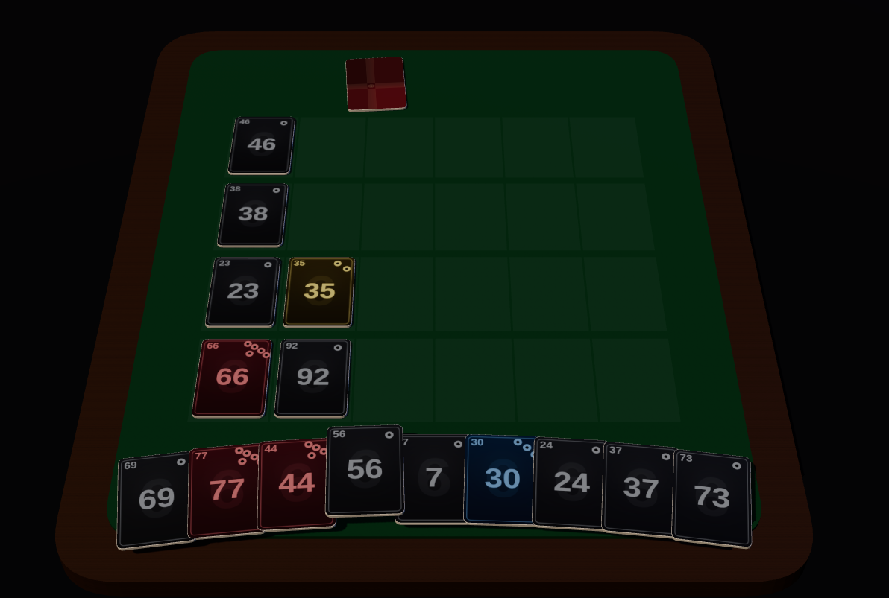

# Take 6

A [6 Nimmt!](https://en.wikipedia.org/wiki/6_Nimmt!)-like card game: a TypeScript game engine plus web viewers, built for the [boardgamers.space](https://boardgamers.space) platform.



## Quick start

```sh
pnpm install
pnpm --filter take6-viewer-3d dev
```

Then open the printed URL (default http://localhost:5203). You'll get a local game against five AI opponents — no server needed.

Useful query params while testing: `?players=3` changes the number of players (default 6), and `?points=2&handSize=2` shortens the game so you can reach the end screen quickly.

## Repository layout

| Package | Path | Status |
| --- | --- | --- |
| [`take6-engine`](engine/) | `engine/` | Active — the game logic |
| [`take6-viewer-3d`](viewer-3d/) | `viewer-3d/` | Active — the 3D viewer |
| `take6-viewer` | `viewer/` | Archived — canvas (Hex Engine) viewer |
| `@gaia-project/take6-viewer` | `viewer-svg/` | Archived — Vue 2 SVG viewer |

### `engine/` — `take6-engine`

The full game logic: setup, moves, AI moves, state serialization (`stripSecret`), state reconstruction, and scoring, plus a mocha/chai test suite. Published as an ES module (TypeScript 5, NodeNext).

It also exports `wrapper.ts`, the boardgamers.space contract (`init` / `move` / `moveAI` / `logSlice` / `stripSecret` / …).

### `viewer-3d/` — `take6-viewer-3d`

The current viewer. Built with [three.js](https://threejs.org) and bundled with Vite. See its [README](viewer-3d/README.md) for details.

### Archived viewers

`viewer/` (Hex Engine canvas) and `viewer-svg/` (Vue 2) are kept for reference but are no longer maintained. They predate this monorepo and their docs still reference the old standalone repositories and yarn tooling. Prefer `viewer-3d/` for anything new.

## Development

This repo uses [pnpm](https://pnpm.io) workspaces.

```sh
pnpm install   # install all workspace dependencies
pnpm build     # build every package that defines a build script
pnpm test      # run the engine's test suite
```

Per-package scripts use pnpm's `--filter`:

```sh
pnpm --filter take6-engine test
pnpm --filter take6-viewer-3d check
```

## License

MIT (see [LICENSE](LICENSE)).
